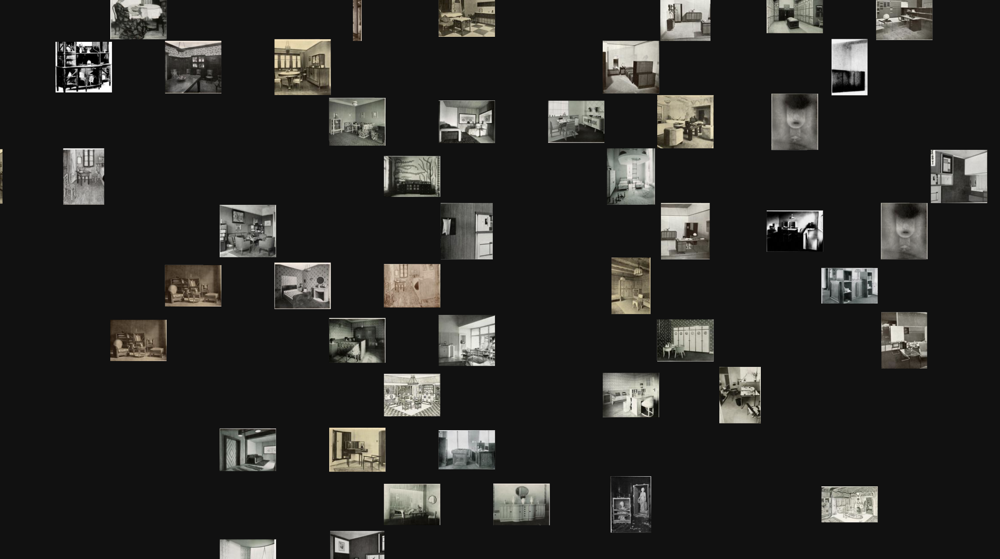

# Illustration metadata enrichment

We now have all the illustrations that are present in our corpus. We want to make the dataset more interesting by adding some metadata to the illustrations. 

The proposed steps are :

- Finding the category of the object illustrated
- Associate illustrations with descriptors from researchers
- Find topics discussed around the illustrations
- Find name/authors of artworks

## Clustering of images based on structural similarity

To have a first look at the dataset structure, we first used [Pixplot](https://github.com/YaleDHLab/pix-plot), to visualize our illustrations in a two-dimensional projection within which similar images are clustered together. We use the HDBCAN algorithm to create the clusters of images, and then UMAP to be able to visualize the results into the 2D space. With this first approach, we can identify different categories of illustrations, more or less precisely. Here is an example of cluster of pictures of furnitures :

Some other identified clusters are : 

- architecture plans, drawings, arches, facades
- interiors, landscapes, trees, boats drawings
- portraits, portraits of people in dress
- statues, busts, vases, necklaces, chairs
- engravings, doodles, letters
- abstract paintings 

The list is not exhaustive, and you can find pictures of part of the clusters in `./img/`

## Classification of illustration : is it a painting reproduction or something else ?

Ideally, we would like to be able to find tags for the different illustrations. But those tags would be very different if the illustration were a painting or a photography of an object for example. That is why, the first classification that we will do will be to determine if the illustration is a painting reproduction or not. It is done in `b_painting_other_classification.ipynb`.

We first try a simple ResNet32 architecture, for 17 cycles, and get a final accuracy of 0.80. That is not bad but we would like to do better, because right now on the test set out of 200 illustrations, 27 were wongly classified as 'other', and 13 as 'reproduction'. 

If we look at the current state-of-the-art in terms of image classification, we see that Transformers models are beginning to shine in the field of Computer Vision too (where they were first used and showed great success in Natural Langage Processing). In the `TODO` notebook, we focused on training such a model, fousing especially on finding adapted Data Augmentation and Regularization parameters, as their improtance has been demonstrated in [this](https://arxiv.org/pdf/2106.10270.pdf) paper. As also mentionned in the paper, for trainings with relatively small datasets - as it is the case here - transfer learning leads faster to better results, so we will use a pre-trained model.
